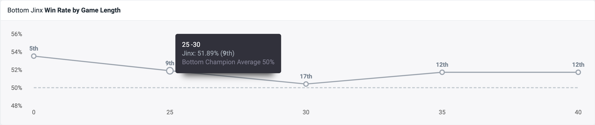

# Experiential Learning Reflection and Narrative

## Luyao Wang

### Class of 2024 | Data Science

In this section, I will reflect on the difficulties I encountered during the project and discuss some additional topics that were not included in the final report.

## Web Scraping Challenges

As mentioned in the report, I faced challenges while scraping champion data from [OP.GG](https://www.op.gg/champions). However, there are more details to discuss regarding this aspect. OP.GG implements a CAPTCHA system (or maybe using service from Cloudflare) to verify the user's human identity and prevent bot attacks and spam. This posed a problem when trying to request the webpage using the `requests` package in Python. Although I could set my user agent to mimic a browser, the CAPTCHA requires a full browser environment capable of executing JavaScript code. To tackle this issue, I explored using the `selenium` Python package to control the Chrome browser. However, since my objective was solely to fetch the HTML file and not automate tasks, I decided to leverage [headless chrome](https://developer.chrome.com/blog/headless-chrome). Headless Chrome allows running Chrome in a headless environment, providing access to all modern web platform features offered by Chromium and the Blink rendering engine through the command line. Initially, I attempted to use headless Chrome on Windows since I was building application for League of Legends which is exclusively provided in Windows for the China server by Tencent but encountered difficulties with how it handled standard output in PowerShell. Eventually, I switched to macOS, where I was able to make it work. Another challenge I faced was the user agent used by headless Chrome, which included "headless chrome" and indicated that automation tasks were being performed. Consequently, OP.GG required me to solve the CAPTCHA. Fortunately, after some research, I discovered a way to set the user agent by passing the command line option `--user-agent`.



In addition to headless Chrome, I also utilized `selenium` for certain tasks. For example, I attempted to scrape the [win rate by game length information from OP.GG](https://www.op.gg/champions/jinx/trends/adc). However, upon inspecting the webpage elements, I found that the HTML did not contain this information. The chart was implemented using [Rechart](https://recharts.org/en-US/), a charting library that utilizes React and D3.js. The SVG element representing the chart was dynamically drawn using JavaScript, and I did not have direct access to the underlying data used for the chart. The resulting SVG element only displayed the win rate information when the mouse hovered over a data point, triggering a popup `<div>` element with the text information. Therefore, I had to employ selenium to simulate mouse movement on the chart. By moving the mouse over each data point, I could retrieve the win rate information from the popup element. This process was quite complex, and I encountered additional challenges related to working with SVG elements using selenium. I found a [relevant discussion on Stack Overflow regarding this issue: How to find SVG element with selenium?](https://stackoverflow.com/questions/71162169/how-to-find-svg-element-with-selenium). Despite the complexities and challenges, I gained valuable insights into web scraping and web development. This experience taught me that real-world scenarios are often messier and less structured than the examples we encounter in university courses. I recall a specific course, Stats 401, where we learned to scrape data from Wikipedia, which is a well-formatted and standardized HTML document. However, in the realm of software development, real-world scenarios can be far more intricate. This project served as a reminder to always be prepared for such complexities.

## Preparing Dataset Challenges

During the planning phase of this project, I was aware that League of Legends data could be fetched using the Riot API, which seemed like a straightforward solution. However, I soon realized the complexity involved once I delved into the actual implementation.

As mentioned in the report, the game timeline data obtained from the Riot API might lack some necessary information, necessitating the need to fill in the missing details. For example, the timeline data often provides entity identifiers (IDs) for champions, items, and runes. To make this data more meaningful and informative, we have to map these IDs to their corresponding properties. To accomplish this, we rely on Data Dragon, also known as DDragon, which comprises static data files containing comprehensive information and images for champions, runes, and items. However, the challenge arises when dealing with the various representations of these entities. It's not simply a matter of mapping IDs to names. In reality, there are multiple attributes associated with each entity. For example, there is the id, which is a text representation without special symbols or spaces. Then there is the key, which is assumed to be an ID, and the name, which represents the displayed name and can contain spaces and special symbols

```jsonc
...
"DrMundo": {
    "version": "14.7.1",
    "id": "DrMundo",
    "key": "36",
    "name": "Dr. Mundo",
    "title": "the Madman of Zaun",
...
```

In different circumstances, I find myself needing to convert between these three representations. While this may not seem like a major issue, the continuous emergence of these small challenges can be extremely frustrating. It becomes disheartening when you anticipate everything to work smoothly, only to encounter such trivial problems along the way.

When I took the Stats 302 course in machine learning, we primarily worked with preprocessed data for training models. However, for this particular project, I had to prepare the training data myself. One of the more complex challenges was creating a champion-item embedding model to measure the similarity between a champion and an item. I started with the code provided in the [d2l](https://d2l.ai/chapter_natural-language-processing-pretraining/word2vec-pretraining.html)n, which served as a helpful reference. While the underlying ideas were similar, there were notable differences between working with textual data and the context words in word2vec and working with champion-item pairs.

Preparing the dataset required careful consideration. I needed to find an appropriate representation for champion IDs, item IDs, and the fitness score in a Python `iterable`. To improve computational efficiency, I needed to leverage PyTorch's tensor data structure. As a result, I implemented a PyTorch dataloader. However, I believe there is room for improvement in terms of code optimization both in terms of, simplicity, readability, and performance as I did not prepared the data in batches to accelerated use multiplication. Given the chance, I would refactor the implementation to enhance these aspects.

This experience taught me that in real-world machine learning applications, there are practical challenges that extend beyond what is covered in a classroom setting. It highlighted the similarities between machine learning and software development, where encountering and resolving various issues is commonplace. Ultimately, the best way to learn and overcome these challenges is through hands-on practice and experience.

## Software Developing and Machine Learning in Games

In the second part of this reflection, I will delve into the topics of software development and machine learning in the context of games like League of Legends.

As mentioned in the abstract of this report, I would like to acknowledge the inspiration I derived from Java-S12138, a GitHub user who created an open-source application called Record. This application served as the foundation for the pre-game prediction application I developed for League of Legends as part of this project. My interest in predicting outcomes and creating related applications for League of Legends was sparked by one of Java-S12138's videos. Through this video, I discovered the extensive programmability and possibilities within the League of Legends ecosystem.

I was pleasantly surprised to learn that the game provides numerous APIs that can be utilized to develop my own applications. I had not anticipated the extent of programmability offered by the game. This knowledge is not typically taught in schools, but it highlights the power and beauty of programming. In today's age, it is essential for everyone to have some level of programming ability. Here, I use the term "programming" rather than "computer science" because it is not purely a scientific discipline—it is more akin to hacking. While universities teach us the principles of computer science, including data structures, algorithms, statistics, and machine learning, they do not often delve into the realm of practical application development. Therefore, I believe that in the process of learning, it is equally important to acquire both "scientific" knowledge and some hacking skills. I recall a statement made by Prof. Matthias Schroeter during the Stats 302 course, where he mentioned that data science lies at the intersection of mathematical and statistical knowledge, domain expertise, and hacking skills.

Prof. Schroeter also highlighted the potential dangers of solely relying on hacking skills without a broader foundation of knowledge and experience. I have personally encountered similar experiences. Some people might consider coding or merely "being able to write code" is a great thing. It is actually not. Writing code may seem straightforward, but what truly matters is the underlying rationale behind the code—whether it's the algorithms used, the complexities of implementation under the hood, or adherence to software engineering practices.

I wholeheartedly agree with Prof. Schroeter's perspective, and this project serves as a testament to the importance of these three components: a profound understanding of the game League of Legends to ensure meaningful data analysis, proficiency in mathematics and statistics for developing effective machine learning models, and the ability to employ hacking skills to overcome various challenges throughout the program's development.

Returning to the topic of League of Legends, there has been a recent cheating scandal involving a LoL streamer known as 霸哥 (referred to as Buge). Many people suspect that he is cheating or using automation macros due to the seemingly impossible mouse movement patterns he exhibits. He can instantly locate newly placed wards with incredible speed. On Bilibili, I came across a [video](https://www.bilibili.com/video/BV1E6421F7kf/) where the uploader employed an LSTM autoencoder for anomaly detection.

In the context of time series data, anomaly detection aims to identify abnormal points that significantly deviate from previous time steps. An autoencoder is a type of neural network designed to replicate its input as closely as possible at the output. It possesses a hidden layer that encodes the input into a representation. Through training the network to minimize the discrepancy between the input and output, it learns efficient data encodings within the hidden layer. An LSTM autoencoder combines both of these concepts. It utilizes LSTM layers to comprehend temporal input sequences, taking a sequence as input, encoding it into a vector using an LSTM encoder, and then reconstructing this vector back into the original sequence as accurately as possible using an LSTM decoder.

The fundamental premise is that an LSTM autoencoder, when trained on normal time series data, will encode such data very efficiently within its internal representations. However, when anomalous data is presented to the network, the decoder will struggle to properly reconstruct this data since the encoder has not encountered such patterns during training. A higher reconstruction error serves as an indication of the presence of an anomaly. In the video, the uploader trained the model using sequential mouse movement data, representing the x-y axis coordinates of the mouse during instances where the user was not cheating. By employing the LSTM autoencoder on the mouse movement data from the streamer in question, Buge, they observed a higher reconstruction error. This machine learning-based tool suggests that Buge's mouse movement is not normal and strongly indicates his involvement in cheating.

The sequential mouse movement data was collected using a [YOLOv8](https://github.com/ultralytics/ultralytics) model, which is another notable application of machine learning and computer vision. During my summer internship at Juhe Data (聚合数据), I successfully utilized YOLO models to detect the bounding boxes of CAPTCHA letters. Subsequently, I employed a siamese network to analyze the similarity between pairs of intentionally obscured CAPTCHA letters. Additionally, I came across an interesting computer vision-based application for the game Genshin Impact called [BetterGI](https://github.com/babalae/better-genshin-impact), which employs object detection. It offers automation tasks through computer vision and automated control, similar to the Selenium tool we discussed earlier. It's worth noting that using such third-party tools in Genshin Impact is unlikely to result in an account ban, as long as the tools do not modify game files. Detection by the game's developers, miHoYo, would require disk scanning or blacklisting the running process.

One particular functionality of that application that caught my attention is related to fishing in Genshin Impact. In the game, players need to remain stationary for 10 to 30 seconds until a fish bites the hook. Once the fish bites, players must react in time and control the tension on the fishing line by pressing the mouse button to reel in the fish. This process can be tedious and time-consuming. However, developers have created automated tools to handle this task. These tools utilize machine learning and automation techniques to streamline the fishing process.

Machine learning applications in gaming extend beyond fishing automation. The integration of machine learning knowledge has become a significant trend in the current AI-driven era. It is no longer sufficient to have "programming" skills alone; understanding machine learning concepts has become increasingly essential.
